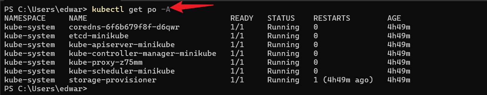

# Working With Kubernetes Pods

### Pods in Kubernetes:

Pods are the smallest deployable units in Kubernetes, encapsulating one or more containers that share the same network, storage, and resources. They ensure efficient and reliable running of containerized applications within the cluster

### Creating and Managing Pods

Interacting with Pods in minikube involves using the powerful `kubectl` command-line tool. `Kubectl` is the command-line interface tool(CLI) for interacting with kubernetes clusters.It allows users to deploy and manage applications,Inspect and manage cluster, and execute various commands against kube clusters.

1 List Pods

    kubectl get po -A

2.Inspect a Pod

    kubectl describe pod <pod-name>
The command above can be used to gain detailed insight into a specific Pod, including events, container information, and overall configuration.

3.Delete a Pod

    kubectl delete pod <pod-name>
Removing a Pod from the Minikube cluster is as easy as issuing this command.

### Containers in Kubernetes

#### Definition and Purpose

From our knowledge of docker,we know container represents a lightweight
standalone,and executable software package that encapsulates everything
needed to run a piece of software,including the code, runtime,libraries,
and system tools. Containers are the fundamental units deployed within pods.
which are orchestrated by Kubernetes.In minikube,containers play a central
role in providing a consistent and portable environment for applications
ensuring they run reliably across various stages of the development lifecycle.

### Integrating Container into Pods:

Pod Definition with containers: In the kubernetes world,containers come to lifecycle.
Developers define a Pod YAML file that specifies the containers to run,their images and 
other configuration details.This Pod becomes the unit of deployment,representing a cohesive
application.

Using `kubectl`, we can deploy Pods and, consequently, the containers within them
to the Minikube Cluster. This process ensures that the defined containers work in concert within
the shared context of a Pod.

